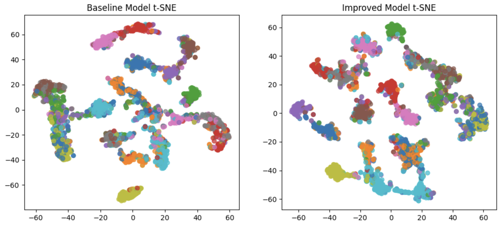
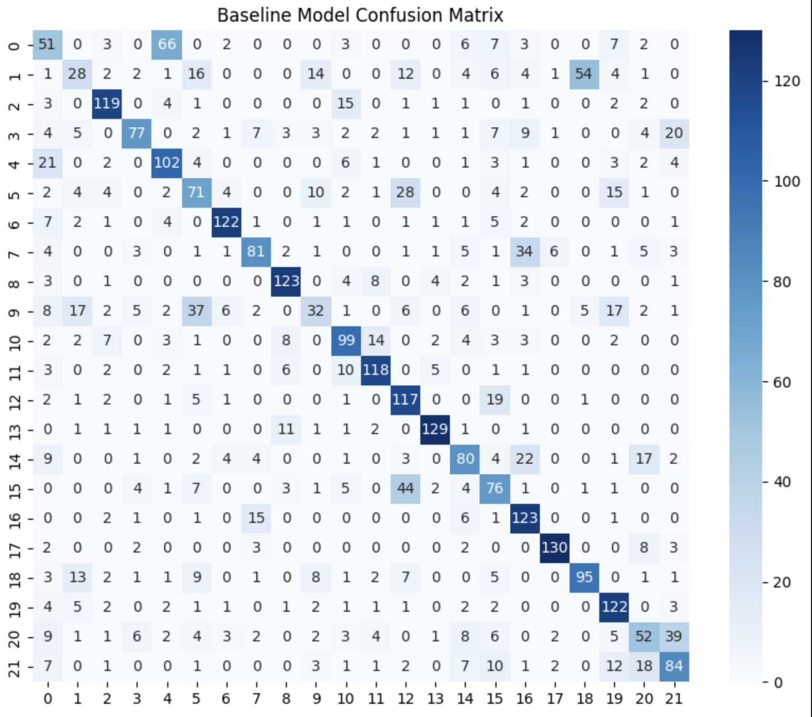
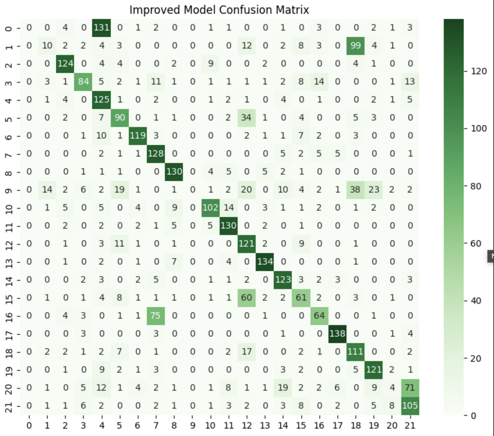

# Spoken Language Identification for 22 Indian Languages

Fine-tuning **mHuBERT-147** to identify which of 22 Indian languages is being spoken in a
short audio clip, and testing whether the model learns *language* or *speaker identity*.

University project (NNTI), Saarland University. Joint work by **Malik Saad Wazir**,
**Aiswarya Krishnadas** and **Divyashree Mohan**.

Fine-tuned model: [`Saad-Wazir24/indic-slid-mhubert`](https://huggingface.co/Saad-Wazir24/indic-slid-mhubert)

## The problem

The dataset ([`badrex/nnti-dataset-full`](https://huggingface.co/datasets/badrex/nnti-dataset-full))
provides only **5 speakers per language** — 110 speakers in total. With that few voices, a
classifier can score well without learning anything about language: it can simply memorise
which voice belongs to which class.

## Results

Two models are compared, both fine-tuned from mHuBERT-147 and both evaluated on the same
validation split (3,300 samples, 150 per language):

- **Tuned** — hyperparameter tuning only (dropout, 10 s clips, LR schedule, gradient accumulation)
- **Tuned + augmentation** — the same configuration with audio augmentation added to training

| | Tuned | Tuned + augmentation |
|---|---|---|
| Accuracy | 0.59 | **0.61** |
| Macro F1 | 0.55 | **0.57** |

The untuned starting point provided with the task scored 31.96%.

Augmentation improved accuracy slightly — but the accuracy figures are not the interesting
part. What changed is *what the model uses to decide*.

### Evidence about speaker identity

**t-SNE of the learned embeddings.** Without augmentation, each language appears as several
tight, separated sub-clusters — consistent with the model encoding individual voices rather
than languages, given 5 speakers per class. With augmentation these sub-clusters merge into
larger, more cohesive groups, though several languages remain mixed.



**Confusion matrices.** Errors shift toward genuinely similar languages: Hindi is
misclassified as Urdu 54 times without augmentation and 99 times with it, and the augmented
model's errors fall into fewer, larger cells rather than spreading across the matrix. This is
the error pattern expected from a model attending to phonetics.




### Where it got worse

Augmentation **loses Konkani and Maithili entirely** (F1 0.00, from 0.03 and 0.20) and
lowers Hindi (0.22 → 0.11). It gains substantially on Sindhi (0.10 → 0.60), Dogri
(0.32 → 0.45), Manipuri (0.44 → 0.51) and Gujarati (0.71 → 0.75). The overall accuracy gain
hides a redistribution: several weak languages improve, two are abandoned.

Full per-language metrics: `results/tables/`.

## Approach

**Model.** mHuBERT-147, fine-tuned for audio classification. Compared against larger
multilingual models (`facebook/mms-300m`, see `archive/`) and preferred because the dataset
is small and mHuBERT-147 is parameter-efficient.

**Preprocessing.** Audio resampled to 16 kHz, clips extended from 7 s to 10 s to capture more
phonetic context.

**Augmentation** (`audiomentations`), applied to training data only:

| Transform | Range |
|---|---|
| Pitch shift | ±4 semitones |
| Gaussian noise | amplitude 0.001–0.015 |
| Time stretch | 0.8–1.2× |

The aim is to make speaker identity an unreliable cue, pushing the model toward linguistic
features.

**Training.** Batch size 2, gradient accumulation 16, 7 epochs, lr 2e-5, weight decay 0.04,
500 warmup steps, dropout 0.1 (hidden, attention, activation, feature projection). Tracked
with Weights & Biases.

## Limitations

- **Speaker overlap between the train and validation splits was not checked.** The
  splits come pre-made from the dataset and the notebook does not verify whether the
  same speakers appear in both. If they do, neither accuracy figure measures
  generalisation to unseen voices. Either way the evidence about speaker bias here is
  representational (t-SNE, error structure) rather than a held-out speaker test. A
  speaker-disjoint evaluation would settle both points — this is the clearest next step.
- **Single training run per configuration.** Run-to-run variance was not measured, so the
  2-point accuracy difference should not be treated as a reliable margin.
- Two languages collapse to zero F1 under augmentation, which the headline accuracy hides.
- `report/mainreport.pdf` reports 65.3% and 61.3%. Those are best training-time eval figures,
  measured under different conditions from the matched post-hoc comparison above, and are not
  directly comparable to it or to each other. The table above uses the matched evaluation.

## Repository

```
notebooks/train_model.ipynb      training and evaluation
report/mainreport.pdf            full project report
results/figures/                 t-SNE, confusion matrices
results/tables/                  per-language classification reports
archive/                         earlier facebook/mms-300m experiments, superseded
requirements.txt
```

## Running

The notebook was developed on Kaggle and reads the Hugging Face and Weights & Biases
credentials via `UserSecretsClient`. To run it there, add `HF_TOKEN` and `WANDB_KEY` as
Kaggle secrets.

To run elsewhere, replace the `UserSecretsClient` calls with environment variables and install
dependencies:

```bash
pip install -r requirements.txt   # torch requires the CUDA index URL, see file header
```

A GPU is required. Weights & Biases logging is not optional in the notebook as
written — wandb.login() and wandb.init() run unconditionally. To run without it,
remove those two calls and set report_to="none" in TrainingArguments.

## Stack

PyTorch, Hugging Face Transformers and Datasets, audiomentations, scikit-learn, librosa.


Contributors


Saad Wazir


Divyashree Mohan


Aishwarya Krishnadas
